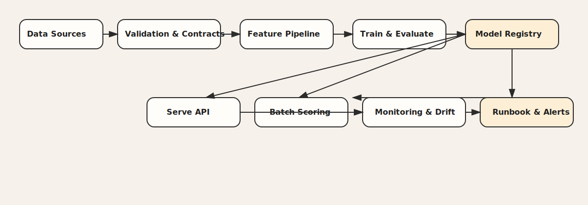

# Production ML Portfolio — Daniel Varela Perez
    

Portafolio para rol **Senior ML Engineer / Applied Scientist (Production ML)**: pipelines reproducibles, validación y trazabilidad, despliegue (API/batch), monitoreo (drift + performance) y operación con runbooks.

## Contacto
- Nombre: Daniel Varela Perez
- Ubicación: Ciudad de México, MX
- Email: bedaniele0@gmail.com
- Tel: +52 55 4189 3428
- GitHub: https://github.com/bedaniele0
- LinkedIn: https://linkedin.com/in/daniel-varela-perez
- CV 1 página: [ES MD](cv/CV_Daniel_Varela_Perez_1P_ES.md) | [EN MD](cv/CV_Daniel_Varela_Perez_1P_EN.md) | [EN PDF ATS](cv/CV_Daniel_Varela_Perez_1P_EN_ATS.pdf)

## Perfil
Senior ML Engineer / Applied Scientist (Production ML) con enfoque end-to-end: diseño, validación, despliegue (API/batch) y monitoreo operacional (drift + performance). Foco en confiabilidad, trazabilidad y handoffs claros (runbooks/checklists). Los dominios (churn/fraude/riesgo/forecasting) se usan solo como contexto para demostrar capacidades de operación.

## Galería destacada

<em>Fraude — panorama del modelo</em> 

<em>Fraude — métricas detalladas</em> 

<em>Riesgo crediticio — análisis de umbral</em> 

<em>Riesgo crediticio — importancia de variables</em> 

<em>Walmart Forecasting — KPIs</em> 

<em>Walmart Forecasting — predicciones</em> 

## Arquitectura (Production ML)

<em>De datos a operación: validación → entrenamiento → registro → serving/batch → monitoreo → runbooks</em> 

## Demo en vivo
- ✅ Fraud Detection (Streamlit): https://bedaniele0-fraud-dete-dashboardfraud-detection-dashboard-lvseck.streamlit.app/
- Demo local en cada proyecto (API + dashboard / batch) documentado en `projects/*/README.md` (comandos `make`)

**Disponibilidad:** abierto a roles remotos.

## Destacados (Top 3)
1) **Fraud Detection System (E2E)** — Detección de fraude con API + dashboard.  
   - Métricas: ROC-AUC 95.28% | Precision 93.62% | Recall 72.13%  
   - ROI demo: ahorro potencial ~$25.9M/año (escenario conservador ~$7.8M)  
   - Repo: `projects/fraud-detection`
   - Case Study (1 página): `projects/fraud-detection/CASE_STUDY.md`

2) **Credit Risk Scoring (E2E)** — Scoring crediticio con calibración y umbral por costos.  
   - Métricas: AUC 78.13% | KS 42.51% | Recall 87.04% | Brier 0.1349  
   - Repo: `projects/credit-risk`
   - Case Study (1 página): `projects/credit-risk/CASE_STUDY.md`

3) **Walmart Demand Forecasting (E2E)** — Forecasting retail con pipeline + API/dashboard.  
   - Métricas: MAE 0.6845 | RMSE 3.9554 | MAPE 52.75% (batch N=28,000)  
   - ROI demo: ~$467K/año (10 tiendas)  
   - Repo: `projects/demand-forecasting`
   - Case Study (1 página): `projects/demand-forecasting/CASE_STUDY.md`

## Referencias Adicionales (1 línea cada una)
- Nota: Proyectos de referencia (demo) enfocados en resultados. Código completo disponible a solicitud.
- `projects/powergrid-forecast` — Forecasting energético | MAPE 5.10% | R2 0.9555
- `projects/diabetes-prediction` — Clasificación médica | AUC 84.14% | Recall 74.07%
- `projects/churn-prediction` — Churn | AUC 83.80% | Recall 92.51%
- `projects/retail-inventory` — Inventarios | MAE 6,937 | RMSE 24,318
- `projects/olist-retention` — Retención | AUC 99.50% | Recall 96.40%
- `projects/telco-churn` — Churn Telco | AUC 83.20% | F1 62.40%
- `projects/user-score` — Batch E2E | MAE en objetivo | R2 por optimizar

All Projects (10) - KPI Snapshot

| Proyecto | Tipo | KPI 1 | KPI 2 | KPI 3 |
|---|---|---:|---:|---:|
| `projects/fraud-detection` | Clasificación | ROC-AUC 95.28% | Precision 93.62% | Recall 72.13% |
| `projects/credit-risk` | Clasificación | AUC 78.13% | KS 42.51% | Recall 87.04% |
| `projects/demand-forecasting` | Regresión | MAE 0.6845 | RMSE 3.9554 | MAPE 52.75% (batch N=28,000) |
| `projects/powergrid-forecast` | Regresión | MAPE 5.10% | R2 0.9555 | MAE 319.88 kW |
| `projects/diabetes-prediction` | Clasificación | AUC 84.14% | Accuracy 78.57% | Recall 74.07% |
| `projects/churn-prediction` | Clasificación | AUC 83.80% | Recall 92.51% | Precision 42.51% |
| `projects/retail-inventory` | Regresión | MAE 6,937 | RMSE 24,318 | R2 0.119 |
| `projects/olist-retention` | Clasificación | AUC 99.50% | Precision 99.70% | Recall 96.40% |
| `projects/telco-churn` | Clasificación | AUC 83.20% | F1 62.40% | ROI 4.56x |
| `projects/user-score` | Regresión | MAE en objetivo | R2 por optimizar | Batch E2E |

Cada proyecto incluye comandos demo locales y documentación técnica/ejecutiva.

