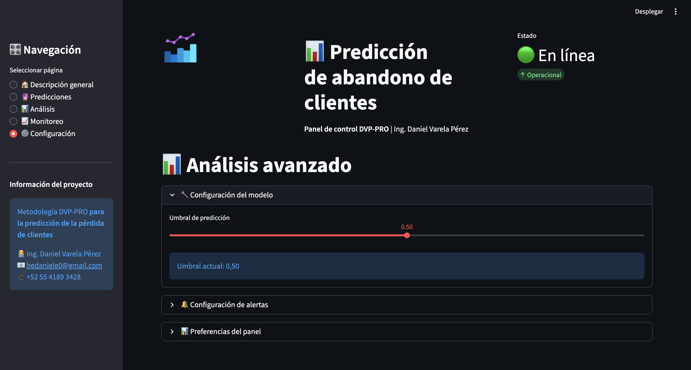
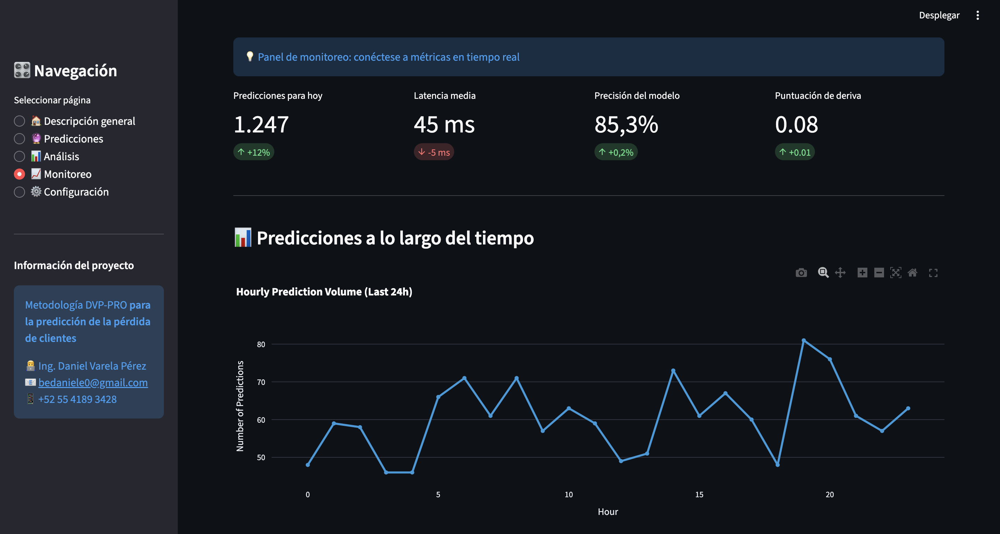

# Customer Churn Prediction (E2E)

**One-liner:** Sistema end-to-end para predecir churn y priorizar acciones de retención con enfoque costo/beneficio (umbral operativo).  
**Stack:** Python, LightGBM, FastAPI, Streamlit, MLflow.  
**Deliverable:** Pipeline reproducible + API + dashboard + monitoreo.  
**Results:** AUC 83.80%, Recall 92.51%, Precision 42.51%, F1 58.25%.

## Problem
Predecir qué clientes tienen mayor probabilidad de abandonar para enfocar campañas de retención. La parte crítica es decidir el **umbral** según costos: retener a quien no se iba (FP) vs perder a quien sí se iba (FN).

## Data
- Source: IBM Telco Customer Churn (público)
- Size: 7,043 filas (CSV)

## Approach
- EDA + preparación (missing, encoding, escalado si aplica).
- Entrenamiento de modelo y evaluación con métricas de clasificación (AUC, precisión/recall, F1).
- Optimización de umbral con criterio de negocio (costo-beneficio / ROI si aplica).
- Exposición mediante API y dashboard para scoring y exploración.

## Results
- Metric(s): AUC 83.80%, Recall 92.51%, Precision 42.51%, KS 0.5429
- Key insight: Ajustar umbral por costo suele mejorar valor de negocio frente a maximizar una sola métrica.

**Nota:** Proyecto de referencia (demo) enfocado en resultados. Código completo disponible a solicitud.

## Impact
- Objetivo de negocio: reducir riesgo o mejorar decisión operativa
- Solución: pipeline end-to-end con modelo + API + dashboard
- Métrica clave: ver sección Results
- ROI demo: ver sección Results si aplica

## Dashboard

<em>Distribución de churn</em> 

<em>Boxplots numéricos</em> 

## Demo
- API: local (`uvicorn src.api.churn_api:app --reload`)
- Dashboard: local (`streamlit run src/visualization/dashboard.py`)

## How to run
- Install:
  - `pip install -r requirements.txt`
- Run:
  - `uvicorn src.api.churn_api:app --reload`
  - `streamlit run src/visualization/dashboard.py`

## Next steps
- Calibración de probabilidades y análisis por segmentos (plan, región, tenure).
- Monitoreo: performance y drift por ventana temporal.
