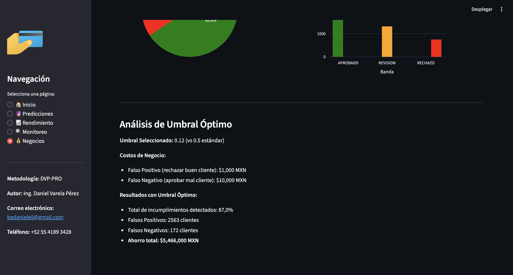
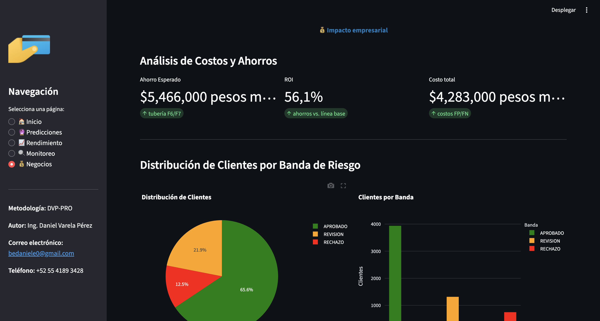

# Credit Risk Scoring (E2E)

**One-liner:** Sistema de scoring crediticio para estimar probabilidad de default y habilitar decisiones de riesgo vía API y monitoreo.  
**Stack:** Python, pandas, scikit-learn/LightGBM, FastAPI, Streamlit (si aplica), monitoreo de drift (si aplica).  
**Deliverable:** API (FastAPI) + pipeline reproducible + monitoreo (drift/metrics).  
**Results:** AUC 78.13%, KS 42.51%, Recall 87.04% (threshold 0.12), Brier 0.1349.

## Problem
Construir un modelo de riesgo crediticio que entregue probabilidades confiables (calibradas si aplica) y permita operación segura en un flujo de evaluación de solicitudes.

## Data
- Source: UCI Default of Credit Card Clients (Taiwan)
- Size: 30,000 clientes, 23 features + target

## Approach
- Preparación de datos (missing, outliers) y validación para evitar leakage.
- Entrenamiento y selección por métricas de ranking (AUC/KS) y/o calibración (Brier / reliability).
- Exposición por API y monitoreo: drift de variables + performance por ventanas.

## Results
- Metric(s): AUC 78.13%, KS 42.51%, Recall 87.04%, Precision 31.07%, Brier 0.1349
- Key insight: En riesgo, además de AUC/KS, la calibración y el monitoreo son críticos para decisiones consistentes.

## Impact
- Objetivo de negocio: reducir riesgo o mejorar decisión operativa
- Solución: pipeline end-to-end con modelo + API + dashboard
- Métrica clave: ver sección Results
- ROI demo: ver sección Results si aplica

## Dashboard

<em>Optimización de umbral</em><br>

<em>Importancia de variables</em><br>

## Demo
- API: local (`make api`)
- Dashboard: local (`make dashboard`)

## Quickstart (local)
```bash
make install
make train
make api
make dashboard
make monitor
```

## How to run
- Install:
  - `make install`
- Run:
  - `make api`
  - `make dashboard`

## Repo structure
- `src/` lógica de datos/features/modelo
- `src/api/` API FastAPI
- `src/visualization/` dashboard
- `tests/` pruebas (si aplica)
- `reports/` figuras y resultados

## Next steps
- Definir política de decisión: umbral por costo + revisión manual.
- Agregar explainability (SHAP) y reportes de estabilidad (PSI/KS por feature).
