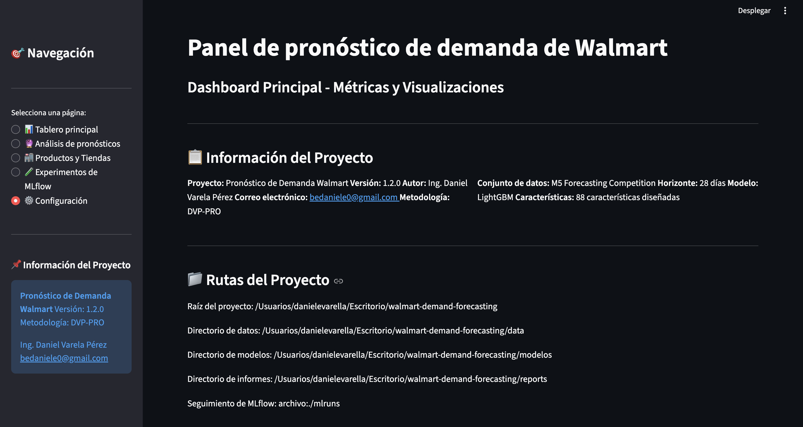

# Walmart Demand Forecasting (E2E)

**One-liner:** Plataforma end-to-end para pronosticar demanda (M5/Walmart) y habilitar planeación de inventario vía API y dashboard.  
**Stack:** Python, pandas, LightGBM/ML, MLflow (si aplica), FastAPI, Streamlit.  
**Deliverable:** Pipeline reproducible + tracking (si aplica) + API + Dashboard.  
**Results:** MAE 0.6845, RMSE 3.9554, MAPE 52.75% (batch N=28,000).

## Problem
Predecir la demanda futura por tienda/producto para soportar decisiones de inventario y reposición, minimizando errores y evitando leakage temporal.

## Data
- Source: M5 Forecasting (Walmart) / Kaggle
- Size: 30,490 series, 1,969 días históricos

## Approach
- Feature engineering temporal (lags, rolling stats, calendarios/eventos, precios).
- Backtesting con split temporal y evaluación consistente.
- Modelo (LightGBM u otro) + registro/experimentos (si aplica) y exposición mediante API/dashboard.

## Results
- Metric(s): MAE 0.6845, RMSE 3.9554, MAPE 52.75% (batch)
- Mejora vs baseline: 29.78% MAE, 33.29% RMSE
- Key insight: Las variables de calendario/eventos + lags/rolling capturan estacionalidad y mejoran el desempeño vs baselines.
  - ROI demo (10 tiendas): ~$467K/año

## Impact
- Objetivo de negocio: reducir riesgo o mejorar decision operativa
- Solucion: pipeline end-to-end con modelo + API + dashboard
- Metrica clave: ver seccion Results
- ROI demo: ver seccion Results si aplica

## Dashboard

<em>KPIs generales</em> 

<em>Predicciones recientes</em> 

## Demo
- API: local (`make api`)
- Dashboard: local (`make dashboard`)

## How to run
- Install:
  - `pip install -r requirements.txt`
- Run:
  - `make api`
  - `make dashboard`

## Repo structure
- `src/` lógica de datos/features/modelo
- `app/` API y/o dashboard
- `reports/` figuras y resultados
- `tests/` pruebas (si aplica)

## Next steps
- Agregar intervalos de predicción (quantiles) para decisiones de stock.
- Monitoreo de drift estacional y performance por familia/categoría.
