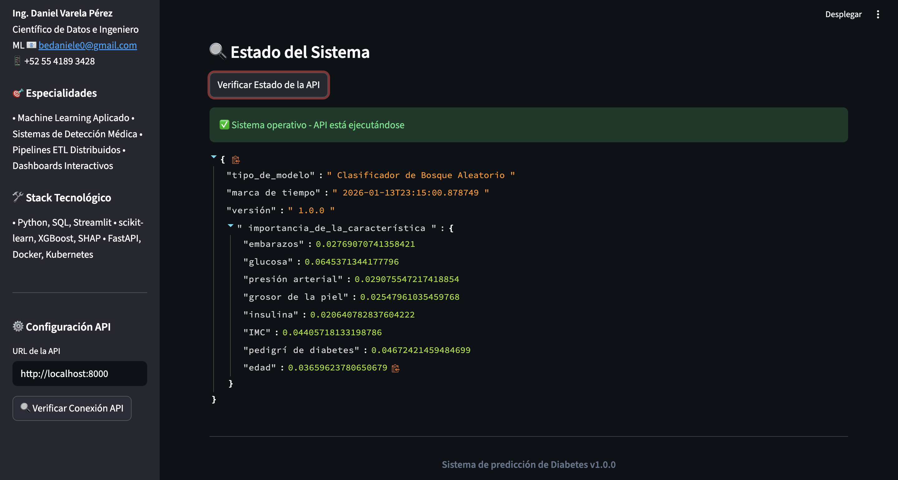

# Clinical Diabetes Prediction Platform (E2E)

**One-liner:** Plataforma end-to-end para predicción de diabetes con explicabilidad (SHAP) y consumo vía API + dashboard (si aplica).  
**Stack:** Python, RandomForest, SHAP, FastAPI, Streamlit.  
**Deliverable:** Pipeline reproducible + API + dashboard + explicabilidad.  
**Results:** AUC 0.8414, Accuracy 0.7857, Recall 0.7407 (piloto).

## Problem
Apoyar detección temprana estimando riesgo de diabetes a partir de variables clínicas. Importante: interpretar predicciones (explicabilidad) para confianza y adopción.

## Data
- Source: Pima Indians Diabetes Dataset
- Size: 768 filas, 8 features + target

## Approach
- Preparación de datos (missing, escalado/encoding si aplica).
- Entrenamiento y evaluación con validación adecuada; selección por métricas (AUC/F1/Recall).
- Explicabilidad con **SHAP** para entender drivers del riesgo.
- Exposición vía API (y dashboard si aplica) para uso interactivo.

## Results
- Metric(s): AUC 0.8414, Accuracy 0.7857, Recall 0.7407, Precision 0.6780, F1 0.7080, Specificity 0.81
- Key insight: SHAP permite explicar qué variables empujan el riesgo por paciente, facilitando revisión y confianza del modelo.

## Impact
- Objetivo de negocio: reducir riesgo o mejorar decision operativa
- Solucion: pipeline end-to-end con modelo + API + dashboard
- Metrica clave: ver seccion Results
- ROI demo: ver seccion Results si aplica

## Dashboard

<em>Resumen del modelo</em> 

<em>Comparativo de resultados</em> 

## Demo
- API: local (`make api`)
- Dashboard: local (`make dashboard`)

## How to run
- Install:
  - `pip install -r requirements.txt`
- Run:
  - `make api`
  - `make dashboard`

## Repo structure
- `src/` API, modelo y preprocesamiento
- `docs/` reportes técnicos/ejecutivos

## Next steps
- Calibración y análisis de umbrales (sensibilidad vs especificidad).
- Evaluación de fairness (si hay variables sensibles) y validación temporal/geográfica si aplica.
