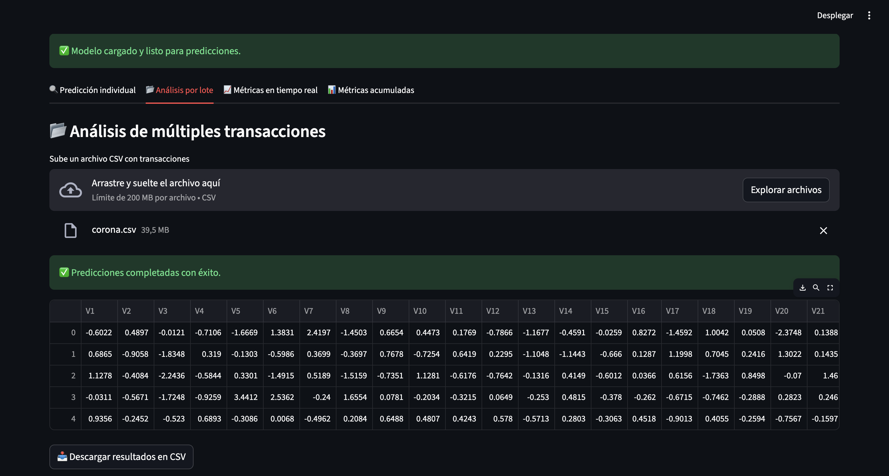
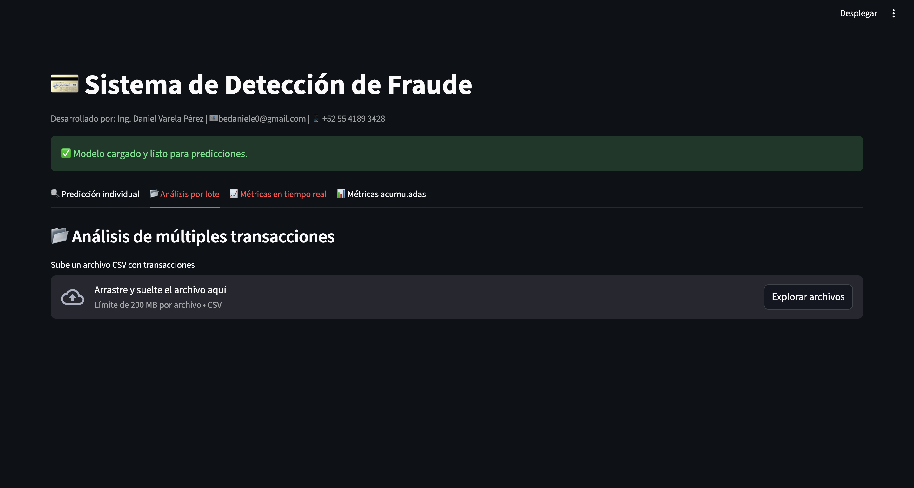

# Fraud Detection System (E2E)

**One-liner:** Sistema end-to-end para detectar transacciones fraudulentas y habilitar decisiones operativas vía API y dashboard.  
**Stack:** Python, pandas, scikit-learn/LightGBM, FastAPI, Streamlit, JWT, Docker (si aplica).  
**Deliverable:** API (FastAPI) + Dashboard (Streamlit) + pipeline reproducible.  
**Results:** ROC-AUC 95.28%, Precision 93.62%, Recall 72.13% (test set).

## Problem
Detectar fraude en transacciones con foco en minimizar falsos negativos sin disparar falsos positivos, habilitando consumo del modelo por sistemas internos mediante una API segura.

## Data
- Source: Kaggle Credit Card Fraud Detection (dataset público)
- Size: 284,807 transacciones, 30 features + Time/Amount + target

## Approach
- Limpieza y preparación de datos + validación para evitar leakage.
- Entrenamiento y comparación de modelos; selección por métricas (ROC-AUC, PR-AUC / F1 según caso).
- Exposición del modelo mediante FastAPI con autenticación JWT y visualización de resultados en dashboard.

## Results
- Metric(s): ROC-AUC 95.28%, Precision 93.62%, Recall 72.13%, F1 81.48%
- Key insight: Ajustar umbral según costo de FN/FP mejora la utilidad operativa frente a optimizar solo una métrica global.
  - ROI demo (supuestos conservadores): ahorro potencial ~$25.9M/año, conservador ~$7.8M/año

## Impact
- Objetivo de negocio: reducir riesgo o mejorar decisión operativa
- Solución: pipeline end-to-end con modelo + API + dashboard
- Métrica clave: ver sección Results
- ROI demo: ver sección Results si aplica

## Dashboard

<em>Comparativa de modelos</em><br>

<em>Análisis detallado del mejor modelo</em><br>

## Demo
- Live (Streamlit): https://bedaniele0-fraud-dete-dashboardfraud-detection-dashboard-lvseck.streamlit.app/
- API: local (`make api`)
- Dashboard: local (`make dashboard`)

## Quickstart (local)
```bash
make install
make api
make dashboard
make monitor
```

## How to run
- Install:
  - `make install`
- Run:
  - `make api`
  - `make dashboard`

## Repo structure
- `src/` lógica de datos/features/modelo
- `api/` API FastAPI
- `dashboard/` app Streamlit
- `tests/` pruebas (si aplica)
- `reports/` figuras y resultados

## Next steps
- Agregar calibración (Platt/Isotonic) si el output se usa como probabilidad.
- Monitoreo de drift + performance (PSI, métricas por ventana temporal).
