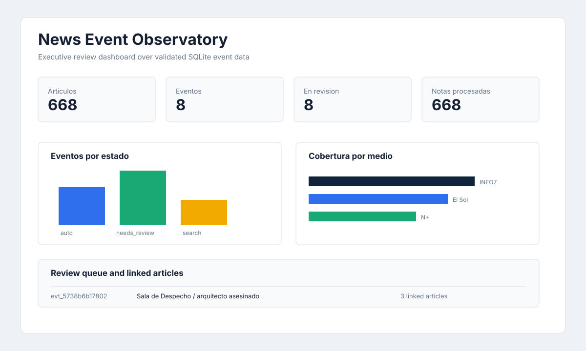
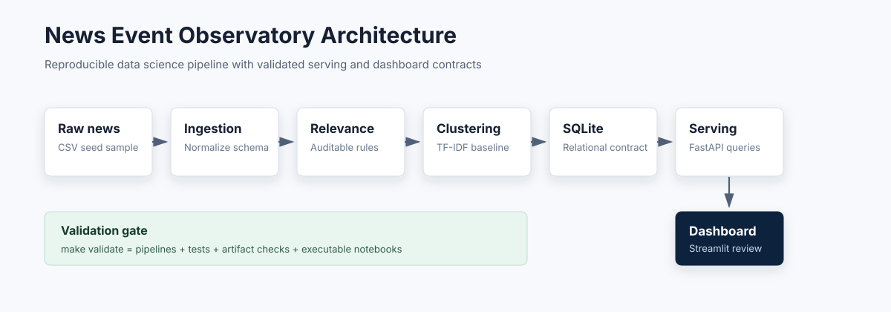

# News Event Observatory


Este proyecto convierte noticias no estructuradas en una base de eventos revisables. Esta construido como proyecto de portafolio de ciencia de datos end-to-end: pipeline reproducible, validacion automatica, base SQLite, API FastAPI, dashboard Streamlit, notebooks ejecutables, Docker y CI/CD.



## Ejecutar El Proyecto

Sigue estos pasos desde una terminal.

### 1. Entrar a la carpeta del proyecto

```zsh
cd /Users/danielevarella/Developer/data-science/news-event-observatory
```

### 2. Instalar dependencias

```zsh
uv sync --extra validation --extra dashboard
```

### 3. Validar que todo funciona

```zsh
make validate
```

Este comando reconstruye el flujo completo y ejecuta pruebas, validacion de artefactos, notebooks y dashboard data reconciliation: los KPI/tablas visibles del dashboard deben coincidir con los datos procesados del proyecto.

### 4. Abrir el dashboard

```zsh
make dashboard
```

Despues abre esta URL en el navegador:

```text
http://127.0.0.1:8501
```

### 5. Abrir la API

En otra terminal:

```zsh
make api
```

URLs utiles:

```text
http://127.0.0.1:8000/docs
http://127.0.0.1:8000/health
http://127.0.0.1:8000/events
http://127.0.0.1:8000/search?q=asesinado
```

## Probar El Proyecto

Ejecutar solo tests de Python:

```zsh
make test
```

Ejecutar solo notebooks:

```zsh
make validate-notebooks
```

Validar que los archivos entregables existen y tienen estructura minima:

```zsh
make validate-artifacts
```

Revisar calidad de codigo:

```zsh
uv run ruff check src tests scripts
```

Ver todos los comandos disponibles:

```zsh
make help
```

## Ejecutar Con Docker

Levantar API y dashboard con Docker Compose:

```zsh
docker compose up --build
```

Servicios:

```text
API:       http://127.0.0.1:8000/health
API docs:  http://127.0.0.1:8000/docs
Dashboard: http://127.0.0.1:8501
```

Construir imagen de API:

```zsh
docker build --target api -t news-event-observatory-api:local .
```

Construir imagen de dashboard:

```zsh
docker build --target dashboard -t news-event-observatory-dashboard:local .
```

## Que Veras En El Dashboard

El dashboard permite revisar:

- KPIs del proyecto;
- eventos detectados;
- articulos vinculados a cada evento;
- cobertura por medio;
- cola de revision humana;
- busqueda de articulos.

## Resultados Del MVP

| Metrica | Valor |
| --- | ---: |
| Filas crudas | 749 |
| Articulos normalizados | 668 |
| Articulos relevantes | 10 |
| Eventos detectados | 8 |
| Enlaces articulo-evento | 10 |
| Eventos en cola de revision | 8 |
| Tests automatizados | 18 |
| Notebooks ejecutables | 7 |

## Arquitectura



```text
raw sources
  -> ingestion
  -> normalized articles
  -> relevance baseline
  -> event clustering baseline
  -> master SQLite database
  -> serving query layer / FastAPI
  -> Streamlit dashboard
```

La logica productiva vive en `src/`. Los notebooks son entregables de revision y narrativa; no son la fuente principal de transformacion.

## Comandos Makefile

| Comando | Para que sirve |
| --- | --- |
| `make help` | Muestra los comandos disponibles. |
| `make ingest` | Ejecuta ingesta y crea articulos normalizados. |
| `make relevance` | Ejecuta ingesta y filtro de relevancia. |
| `make clustering` | Ejecuta ingesta, relevancia y agrupacion de eventos. |
| `make master` | Construye la base SQLite maestra. |
| `make serving` | Valida el contrato de consultas/API. |
| `make dashboard-contract` | Valida el contrato de datos del dashboard. |
| `make test` | Ejecuta tests unitarios e integracion. |
| `make validate-artifacts` | Revisa archivos requeridos y estructura de reportes. |
| `make validate-notebooks` | Ejecuta notebooks con `nbmake`. |
| `make validate` | Ejecuta la validacion E2E completa. |
| `make notebooks` | Abre JupyterLab en `notebooks/`. |
| `make api` | Inicia FastAPI en `http://127.0.0.1:8000`. |
| `make dashboard` | Inicia Streamlit en `http://127.0.0.1:8501`. |
| `make run` | Alias de validacion completa. |

## Componentes

### 1. Ingesta

Carga la muestra semilla demo y normaliza columnas, fechas, medios, URLs y texto.

Salidas:

- `data/interim/normalized_articles.csv`
- `reports/ingestion_report.json`

### 2. Filtro De Relevancia

Aplica reglas configurables para identificar noticias candidatas sobre eventos violentos con actores o actividad economica.

Salidas:

- `data/processed/scored_articles.csv`
- `data/processed/relevant_articles.csv`
- `reports/relevance_report.json`
- `reports/relevance_errors.csv`

### 3. Agrupacion De Eventos

Agrupa notas relevantes usando TF-IDF, similitud coseno y una ventana temporal configurable.

Salidas:

- `data/processed/events.csv`
- `data/processed/article_event_links.csv`
- `data/processed/cluster_review.csv`
- `reports/clustering_report.json`

### 4. Base SQLite Maestra

Consolida los artefactos procesados en una base relacional.

Salidas:

- `data/processed/events.db`
- `reports/master_build_report.json`
- tablas: `articles`, `scored_articles`, `events`, `article_event_links`, `review_queue`, `pipeline_runs`

### 5. API Y Capa De Consulta

Expone consultas versionadas y endpoints FastAPI.

Endpoints principales:

- `GET /health`
- `GET /events`
- `GET /events/{event_id}`
- `GET /events/{event_id}/articles`
- `GET /review-queue`
- `GET /search?q=asesinado`

### 6. Dashboard Streamlit

Interfaz ejecutiva para explorar KPIs, eventos, articulos vinculados, busqueda y cola de revision humana.

## Notebooks

- `notebooks/00_project_overview.ipynb`: resumen ejecutivo.
- `notebooks/01_ingestion_eda.ipynb`: revision de ingesta.
- `notebooks/02_relevance_baseline_review.ipynb`: revision de relevancia.
- `notebooks/03_event_clustering_review.ipynb`: revision de clustering.
- `notebooks/04_master_database_review.ipynb`: revision SQLite.
- `notebooks/05_serving_contract_review.ipynb`: revision API/serving.
- `notebooks/06_dashboard_contract_review.ipynb`: revision dashboard.

## Validacion Automatica

`make validate` es la compuerta obligatoria antes de cerrar cambios o publicar el proyecto.

Ejecuta:

- pipelines de ingesta, relevancia, clustering, SQLite, serving y dashboard;
- tests unitarios e integracion;
- validacion de artefactos;
- ejecucion completa de notebooks.

Estado validado:

```text
ruff check: passed
make validate: passed
21 tests passed
artifact validation passed
7 notebooks passed
0 warnings
docker build api: passed
docker build dashboard: passed
API container /health: passed
Dashboard container health: passed
```

## CI/CD

GitHub Actions incluye:

- Ruff para calidad de codigo;
- `make validate` completo;
- build Docker para API y dashboard;
- validacion de `docker compose config`.

En este portafolio el workflow activo vive en `.github/workflows/news-event-observatory.yml` en la raiz del repositorio. Si el proyecto se publica como repo independiente, puede usar `.github/workflows/ci.yml` con el mismo contrato de validacion.

## Ecosistema E2E De Ciencia De Datos

Este proyecto tambien funciona como referencia para crear proyectos futuros. La regla central es:

```text
Un proyecto no esta listo si una persona no puede instalarlo, ejecutarlo, probarlo y entenderlo desde el README.
```

Guias del ecosistema:

- `docs/e2e-validation-ecosystem.md`
- `docs/readme-execution-contract.md`
- `docs/project-start-checklist.md`
- `docs/architecture.md`
- `docs/data-dictionary.md`
- `docs/model-card.md`
- `docs/dataset-card.md`

## Notas De Publicacion

El repositorio esta preparado para publicarse como portafolio con una muestra pequena de datos semilla. Revisa `docs/privacy-review.md` antes de subirlo a GitHub.

Los outputs generados bajo `data/interim`, `data/processed` y `reports` no se versionan por defecto; se regeneran con `make validate`.

## Licencia

MIT License. Ver `LICENSE`.
