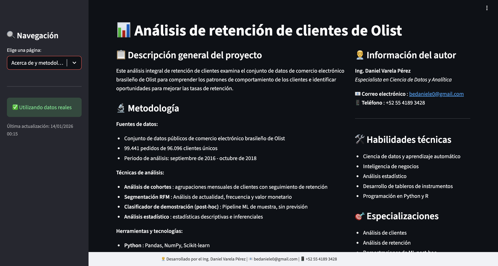
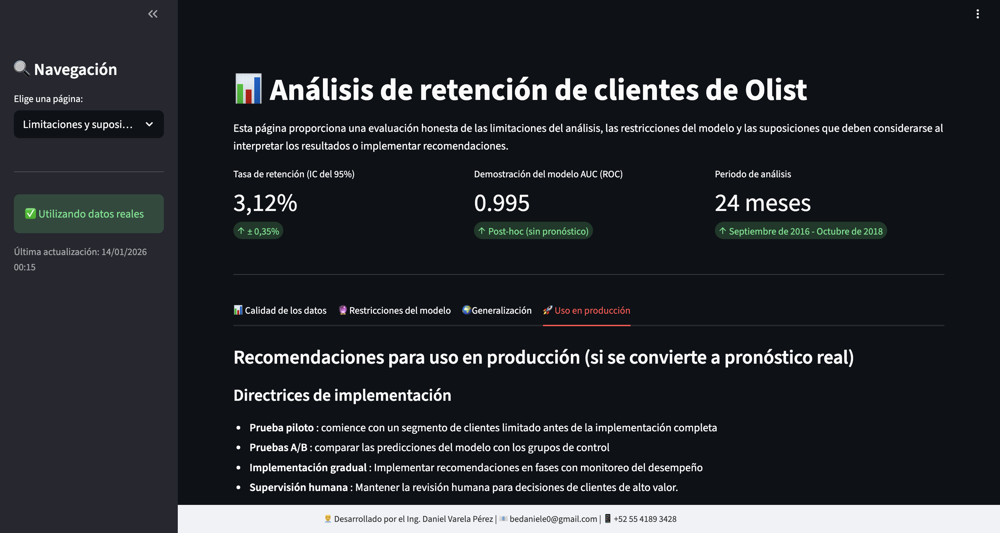

# Olist Customer Retention Analytics (E2E)

**One-liner:** Analítica end-to-end de retención para e-commerce (cohortes, RFM y CLV) con entrega en dashboard y/o API para toma de decisiones.  
**Stack:** Python, pandas, Streamlit, FastAPI.  
**Deliverable:** Reporte analítico reproducible + Dashboard + API (demo).  
**Results:** AUC 99.50%, Precision 99.70%, Recall 96.40% (post-hoc, demo).

## Problem
Entender y mejorar la retención de clientes en un e-commerce: identificar patrones de recompra, segmentar clientes y priorizar acciones (CRM/promos) basadas en valor y probabilidad de retorno.

## Data
- Source: Olist Brazilian E-commerce Dataset
- Size: 99,442 filas en master_dataset (2016-2018)

## Approach
- Cohort analysis para medir retención por mes de primera compra.
- Segmentación **RFM** (Recency, Frequency, Monetary) para activar campañas por tipo de cliente.
- Estimación de **CLV** (aprox.) y/o priorización de clientes de alto valor para acciones de retención.

## Results
- Metric(s): AUC 99.50%, Precision 99.70%, Recall 96.40% (post-hoc)
- Key insight: Los segmentos RFM permiten mover acciones de “masivas” a “priorizadas” (alto valor vs riesgo de churn).

**Nota:** Proyecto de referencia (demo) enfocado en resultados. Código completo disponible a solicitud.

## Impact
- Objetivo de negocio: reducir riesgo o mejorar decisión operativa
- Solución: pipeline end-to-end con modelo + API + dashboard
- Métrica clave: ver sección Results
- ROI demo: ver sección Results si aplica

## Dashboard

<em>Dashboard de retención</em> 

<em>Heatmap de cohortes</em> 

## Demo
- Dashboard: local (`olist-dashboard`)
- API: local (`olist-api`)

## How to run
- Install:
  - `pip install -r requirements.txt`
- Run:
  - `olist-dashboard`
  - `olist-api`

## Next steps
- Agregar métricas de producto (repeat purchase window, time-to-second-purchase).
- Experimentación: propuesta de A/B test para campañas por segmento RFM.
