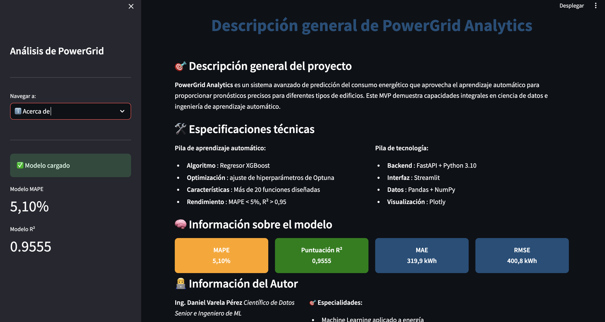
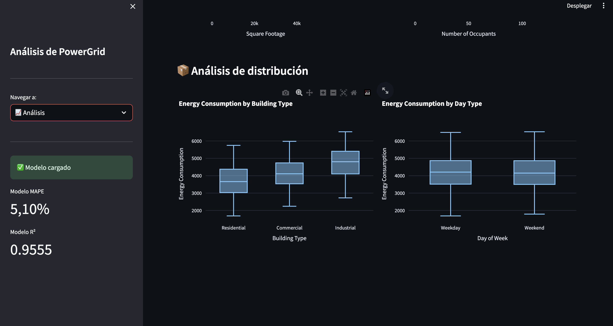

# PowerGrid Analytics — Energy Demand Forecasting (E2E)

**One-liner:** Sistema end-to-end para pronóstico de demanda energética y soporte a operación (API + monitoreo + buenas prácticas).  
**Stack:** Python, XGBoost, FastAPI, Streamlit, Prometheus/Grafana.  
**Deliverable:** Pipeline reproducible + API + dashboard + monitoreo.  
**Results:** MAPE 5.10%, R2 0.9555, MAE 319.88 kW.

## Problem
Pronosticar demanda eléctrica para apoyar planeación operativa y reducir riesgo de sobre/sub-contratación. El reto central es manejar estacionalidad, patrones horarios y evitar leakage temporal.

## Data
- Source: dataset demo de consumo energético
- Size: train 1,000 filas, test 100 filas

## Approach
- Preparación de serie(s): limpieza, manejo de faltantes y creación de variables temporales.
- Backtesting con split temporal (walk-forward o ventanas) para evaluación realista.
- Servicio del modelo mediante API; y si aplica, monitoreo de drift/performance por ventana.

## Results
- Metric(s): MAPE 5.10%, R2 0.9555, RMSE 400.84 kW
- Key insight: La evaluación temporal (backtesting) es clave; un split aleatorio puede inflar métricas y no generaliza.

**Nota:** Proyecto de referencia (demo) enfocado en resultados. Código completo disponible a solicitud.

## Impact
- Objetivo de negocio: reducir riesgo o mejorar decisión operativa
- Solución: pipeline end-to-end con modelo + API + dashboard
- Métrica clave: ver sección Results
- ROI demo: ver sección Results si aplica

## Dashboard

<em>Series y pronósticos</em> 

<em>Evaluación de desempeño</em> 

## Demo
- API: local (`python3 src/run_api.py`)
- Dashboard/Monitoring: local (`streamlit run src/dashboard.py`)

## How to run
- Install:
  - `pip install -r requirements.txt`
- Run:
  - `python3 src/run_api.py`
  - `streamlit run src/dashboard.py`

## Next steps
- Intervalos de predicción (P10/P50/P90) para decisiones bajo incertidumbre.
- Monitoreo de drift estacional y performance por región/segmento temporal.
