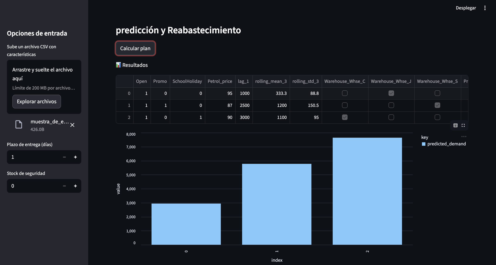
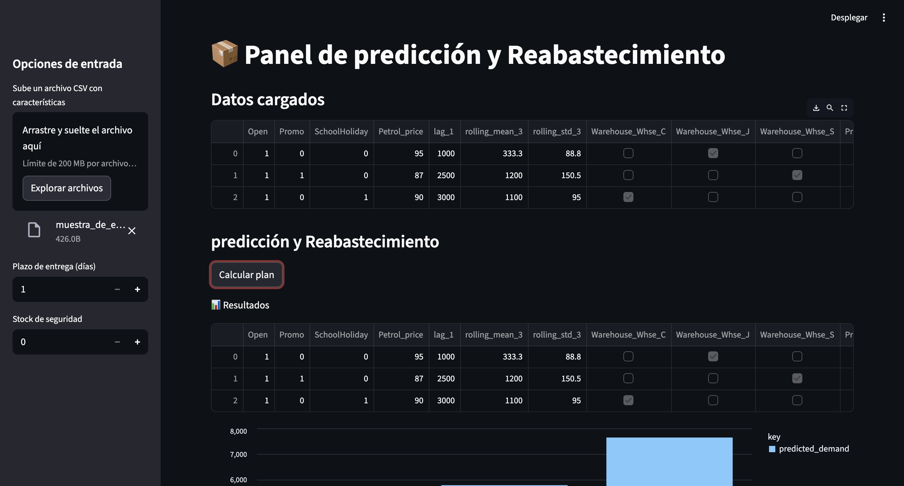

# Retail Inventory Demand + Restocking Plan (E2E)

**One-liner:** Sistema end-to-end para predecir demanda y generar un plan de reabastecimiento, con entrega vía API y dashboard (si aplica).  
**Stack:** Python, LightGBM, FastAPI, Streamlit.  
**Deliverable:** Pipeline reproducible + API + dashboard + plan de restock.  
**Results:** MAE 6,937, RMSE 24,318, R2 0.119 (MVP).

## Problem
Predecir demanda y transformar predicciones en decisiones accionables de inventario: cuánto reabastecer y cuándo, para reducir quiebres de stock y exceso de inventario.

## Data
- Source: dataset demo retail/logistica (interno)
- Size: X_train 135,368 filas (features procesadas)

## Approach
- Preparación de datos + features (temporales, promociones, estacionalidad si aplica).
- Pronóstico / predicción de demanda y evaluación con split temporal.
- Lógica de reabastecimiento (reglas + parámetros: lead time, safety stock, reorder point).
- Exposición mediante API y visualización en dashboard para planeación.

## Results
- Metric(s): MAE 6,937, RMSE 24,318, R2 0.119
- Key insight: Convertir forecast en política de restocking (ROP/safety stock) conecta ML con impacto operativo.

## Impact
- Objetivo de negocio: reducir riesgo o mejorar decision operativa
- Solucion: pipeline end-to-end con modelo + API + dashboard
- Metrica clave: ver seccion Results
- ROI demo: ver seccion Results si aplica

## Dashboard

<em>Predicción de demanda</em> 

<em>Resultados de reabastecimiento</em> 

## Demo
- API: local (`uvicorn api.main:app --reload`)
- Dashboard: local (`streamlit run dashboard/app.py`)

## How to run
- Install:
  - `pip install -r requirements.txt`
- Run:
  - `make run`
  - `make api` / `make dashboard`

## Repo structure
- `src/` lógica de datos/modelo
- `api/` API REST
- `dashboard/` Streamlit

## Next steps
- Simulación de inventario para comparar políticas (baseline vs ML-driven).
- Métricas de negocio: stockouts, overstock, fill rate, costo total.
