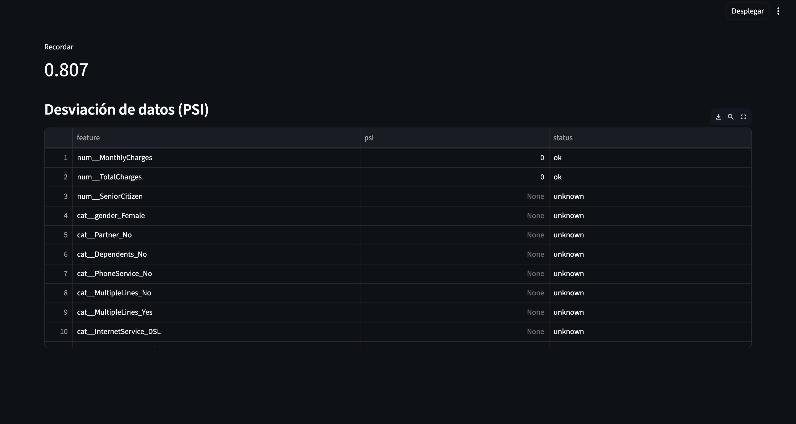

# Telco Churn (IBM) + ROI Policy (E2E)

**One-liner:** Predicción de churn en telecom con política de intervención basada en ROI para priorizar acciones de retención.  
**Stack:** Python, pandas, scikit-learn/LightGBM, FastAPI, Streamlit.  
**Deliverable:** Modelo + evaluación + política ROI + API/Dashboard.  
**Results:** AUC 83.20%, F1 62.40%, Recall 80.70%, Precision 50.80%, ROI 4.56x.

## Problem
Predecir churn y decidir a quién intervenir considerando costos de retención e impacto esperado. En churn, el modelo es solo una parte: la política de acción es lo que genera valor.

## Data
- Source: IBM Telco Customer Churn
- Size: 7,043 filas x 21 columnas (raw)

## Approach
- Preparación de datos (encoding, missing) y evaluación con métricas de clasificación.
- Optimización de umbral / política de intervención basada en ROI (beneficio esperado vs costo).
- (Opcional) Exposición mediante API y/o dashboard para scoring y análisis.

## Results
- Metric(s): AUC 83.20%, F1 62.40%, Recall 80.70%, Precision 50.80% + ROI 4.56x
- Key insight: Un enfoque ROI convierte probabilidades en decisiones, maximizando impacto y evitando gastar en clientes con bajo retorno.

**Nota:** Proyecto de referencia (demo) enfocado en resultados. Código completo disponible a solicitud.

## Impact
- Objetivo de negocio: reducir riesgo o mejorar decisión operativa
- Solución: pipeline end-to-end con modelo + API + dashboard
- Métrica clave: ver sección Results
- ROI demo: ver sección Results si aplica

## Dashboard

<em>Vista del dashboard</em> 

## Demo
- API: local (`uvicorn src.api.main:app --reload`)
- Dashboard: local (`streamlit run dashboard/app.py`)

## How to run
- Install:
  - `pip install -r requirements.txt`
- Run:
  - `uvicorn src.api.main:app --reload`
  - `streamlit run dashboard/app.py`

## Next steps
- Calibración de probabilidades y análisis por segmento (tenure, plan, región).
- Monitoreo de performance y drift por ventana temporal.
